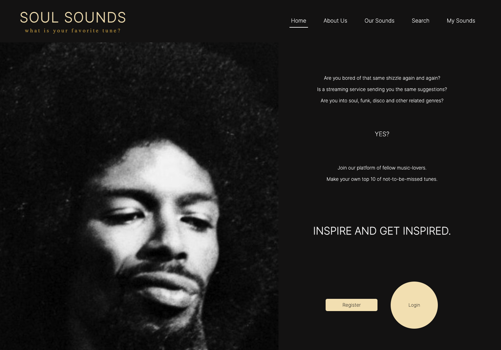

# Getting Started with Create React App

# Project Name

Soul Sounds

## Table of Contents

- [About](#about)
- [Installation](#installation)
- [Usage](#usage)
- [Shout out to](#contributing)

## About



## About The Project

This project is a final assignment for front-end bootcamp at the Novi University of Applied Science.
The project was created by using the API last.fm (https://www.last.fm/).

This application is for all disco-funk-jazz-gospel-house-heads that like to be inspired by fellow music-lovers. What is
the deal?
Say you are stranded at a deserted island and you can only pick 10 favorite tunes. Or the DJ for that night with only 10
songs to be spinned. You have to chose wisely. What tracks would you pick? It is way harder than you think to limit
yourself. That in itself is a challenge, right?
The goal is to limit yourself and to inspire other people with artists or tracks that are rare or just simply a standard
banger. Just because algorithms often don't bring you songs that might inspire you, just what is often listened to. A
sort a crate digging to engage your curiosity.

### Installation

To run this web application make sure that you have an IDE such as Webstorm to compile the code. Best way to run this
application is to use Chrome.

### New at this?

1. Download the application
   Via a zip file
   Via an SSH linknpm start
2. Install the dependencies
3. Start the application

Installing via a Zip

1. Go to GitHub and click on <> Code to download the zip file.
2. After downloading the zip file, you need to extract the file. Navigate to the file and right-click on it, then click
   on Extract All.
   Once you have extracted the file, you can go to your IDE of choice. In this example, we will be using the Jet Brains
   IDE, called WebStorm. When you open the IDE, go to Projects/Open.
3. Then navigate to the extracted file, click on the folder where everything is located, and click OK. Proceed to step
   2.

Installing via a Git link

1. Go to GitHub and click on <> Code and copy the SSH link.
2. Go directly to your IDE of choice. In this example WebStorm is used (Jet Brains IDE) . Once opened the IDE, go to
   Projects/Get from VCS.
3. Paste the link you copied into the URL bar and click on Open.

### Not new at this? then just follow these steps:

1. Clone the repository to your local machine:

   ```bash
   git clone https://github.com/saarryp/eindopdrachtFrontend2023

2. Install project dependencies using npm

   npm install

3. Start development server

   npm start

4. go to www.last.fm and create an API account, to get a token. Open a new file in the root .env en add your Api-token
   LASTFM_API_KEY=JE_API_SLEUTEL_HIER

5. Open your webbrowser and go to http://localhost:3000 to view the application

# NOTE: YOU CAN MAKE AN (registration/login) ACCOUNT FOR **1 HOUR
**. IT IS RUNNING with BACKEND FROM SCHOOL, only limited time of fun...

* CREATE AN ACCOUNT: click the registration button to create an account.
* LOGIN: use the login button to log in.
* MY SOUNDS: you can manage your own list of 10 tunes that are not to be missed.
* SEARCH: you can find tracks and artistnames
* OUR SOUNDS: check what tunes we like and make us curious and proud what you come up with.

## Usage

Just enjoy the funky ride, no other things that need to be mentioned!

## SHOUT OUT TO

MANY, but these ones in particular Rowan (bless you for your patience!), Tessa, Nova, Rav, Elwyn and Sam for leading me
the way in code-jungle.


